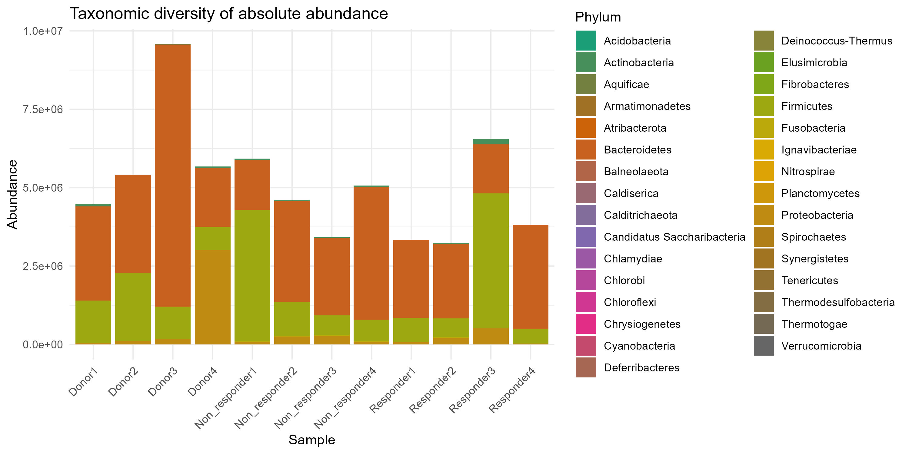
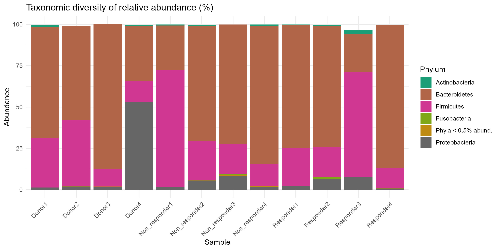
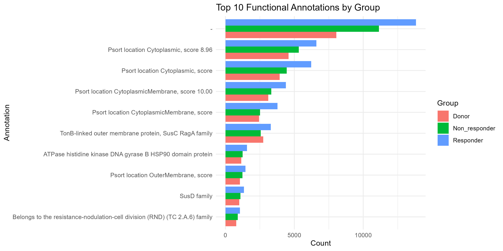

# Metagenomic Analysis of Human Gut Microbiome in Fecal Microbiota Transplantation (FMT) for Weight Loss in Overweight and Obese Individuals
---

## 1. Introduction
The global prevalence of overweight and obesity continues to rise, posing significant challenges for public health owing to their association with chronic metabolic disorders and cardiovascular diseases. Emerging evidence suggests that the gut microbiome plays a crucial role in modulating host energy metabolism, nutrient harvesting, and adiposity regulation. The intestinal microbial community influences fermentation of dietary fibres to short-chain fatty acids (SCFAs), bile acid metabolism, and lipid biosynthesis—pathways that are dysregulated in obesity [1]. For instance, obese individuals often show reduced microbial gene richness and altered functional capacity of microbiomes compared to lean counterparts [2].

Fecal microbiota transplantation (FMT) has been successfully employed in treating recurrent *Clostridioides difficile* infection and is now under investigation as a therapeutic tool for metabolic diseases. In animal models, transplantation of microbiota from lean donors into obese recipients has been shown to influence adiposity and metabolic profiles, suggesting causal roles for gut microbiota in weight regulation [3]. However, human studies of FMT in obesity and metabolic syndrome report mixed outcomes, despite modifications in gut microbial composition and bile acid profiles; consistent weight loss in recipients remains elusive. This highlights the need to better understand which microbial functions (rather than just taxonomic changes) are transferred or engrafted and how these relate to clinical outcomes such as weight loss.

In this project, a comprehensive metagenomic workflow—from raw sequencing reads through taxonomic analysis, gene prediction, and functional annotation— was applied to compare gut microbiome functional capacity among FMT donors, recipient responders, and non-responders. The aim was to elucidate the microbial mechanisms that underlie successful FMT-mediated weight loss in overweight and obese individuals. 

---
## 2. Methods

The workflow for this metagenomic analysis comprised several key steps, from data retrieval and preprocessing to taxonomic and functional characterization. All preprocessing steps—from quality control to BIOM file generation—were performed on the UseGalaxy platform, while downstream statistical and visualization analyses were conducted in R. The workflow consisted of:

1. Data Retrieval and Curation
2. Quality Assessment and Preprocessing
3. Taxonomic Profiling and Visualization
4. Functional Annotation and Pathway Analysis
5. Diversity Analysis and Data Visualization

### **Summary of Methods**

| **Step**                                          | **Purpose**                                                                                                                                                                                                                                                                                                             |
| ------------------------------------------------- | ----------------------------------------------------------------------------------------------------------------------------------------------------------------------------------------------------------------------------------------------------------------------------------------------------------------------- |
| 1. Data Retrieval and Curation                | Raw metagenomic datasets of stool samples from FMT donors and recipients (responders and non-responders) were retrieved from the NCBI Sequence Read Archive (SRA) and curated for downstream analysis.                                                                                                                  |
| 2. Quality Assessment and Preprocessing      | Raw reads were assessed using *FastQC* to evaluate sequence quality, followed by *Trimmomatic* for adapter removal and trimming of low-quality bases, ensuring high-quality reads for accurate downstream analyses.                                                                                                 |
| 3. Taxonomic Profiling and Visualization      | Taxonomic classification was performed using *Kraken2* to identify microbial taxa present in each sample. To obtain more accurate abundance estimates at various taxonomic levels, *Bracken* was used to re-estimate species and genus-level read counts based on *Kraken2* outputs. Results were visualized using *Pavian* and *Krona* (not shown), and outputs were converted into *BIOM format* for use in R-based analyses.                                                                        |
| 4. Functional Annotation and Pathway Analysis | Gene prediction and functional annotation were performed using *Prokka* and *eggNOG-mapper* to assign predicted genes to *COG* and *KEGG* functional categories, enabling exploration of metabolic pathways related to SCFA production, bile acid metabolism, carbohydrate utilization, and lipid biosynthesis. |
| 5. Diversity Analysis and Visualization (R)   | BIOM and annotation files were imported into R. *phyloseq* was used to compute alpha and beta diversity metrics and integrate taxonomic and functional data. Visualizations were generated with *ggplot2* to compare microbial composition and functional potential between donors, responders, and non-responders. |

---

## 3. Results & Discussion

### 3.1 Taxonomic Composition and Diversity

**Figure 1** (Taxonomic diversity of absolute abundance) shows that the phylum *Bacteroidetes* dominated across all 12 samples (4 donors, 4 responders, 4 non-responders). This prevalence is consistent with previous studies in which Bacteroidetes levels are often elevated in obesity-associated gut microbiomes [4]. The fact that donors, responders, and non-responders all show high *Bacteroidetes* suggests that phylum-level dominance may not differentiate FMT outcome groups, and instead, more subtle taxonomic or functional differences may underlie differences in response.

**Figure 2** (Alpha diversity: Observed, Chao1, Shannon indices) reveals that donor samples tended to show higher richness and diversity metrics compared to non-responders, with responders occupying an intermediate position. Although our sample size is small (n = 4 per group), this trend aligns with the concept that higher donor gut microbial diversity may enhance engraftment potential and therapeutic effect in FMT contexts [5]. Conversely, previous meta-analyses have reported inconsistent effects of FMT on α-diversity in obese recipients [6]. Thus, the data used in this study support but do not definitively confirm that diversity may be linked to response status.

**Figure 3** (Beta diversity: NMDS1 & NMDS2) shows clear clustering of donor samples separate from recipients, with responders and non-responders forming overlapping but slightly distinct clusters. This suggests that although recipients share much of their taxonomic makeup, functional shifts or donor-derived strain engraftment may differentiate responders from non-responders. This pattern is also observed in FMT studies, where donor and recipient microbiomes converge but diverge depending on clinical outcome [7]. 

### 3.2 Functional Annotation Profiles

**Figure 4** (COG functional categories) shows that the “Unknown function” category had the highest bars across all three groups, followed by “Carbohydrate metabolism” and other metabolism-related categories. The large unknown fraction is typical in metagenomic studies of the gut microbiome, reflecting the large reservoir of functions yet to be characterised [8]. The fact that carbohydrate metabolism is the second-highest is relevant to obesity: gut microbiota carbohydrate-utilisation functions can influence host energy harvest and fat accumulation [9]. Comparison across groups reveals that responders had slightly higher counts in “Carbohydrate metabolism” than non-responders, which may reflect enhanced microbial capacity for carbohydrate transformation in successful FMT outcomes.

**Figure 5** (Diversity of *Bacteroidetes* at genus level) shows that within *Bacteroidetes*, the genus *Prevotella* was more abundant in non-responders (and in two donor samples and one responder), compared to other genera such as *Phocaeicola* and *Bacteroides*. *Prevotella*-dominance has been linked to high-fibre diets but also to inflammation and metabolic dysregulation in some reports; in FMT for obesity, perhaps a *Prevotella*-rich baseline microbiome is less amenable to beneficial functional restructuring. The higher abundance of *Phocaeicola* and *Bacteroides* in other samples may indicate donor microbiomes more conducive to engraftment or metabolic improvement. This genus-level variation suggests taxonomic nuance beyond phylum-level signals is important.

### 3.3 Relative Abundance and Functional Top Hits

**Figure 6** (Taxonomic diversity of relative abundance (%) plot) reaffirmed that Bacteroidetes comprised a large proportion of the community across groups, but responders showed a slightly lower relative % of Bacteroidetes compared to non-responders and donors, potentially reflecting a more balanced microbiome post-FMT in responders. Prior studies in obesity report that high *Bacteroidetes*: *Firmicutes* ratios are not uniformly prognostic of weight loss, underscoring the need to examine functional capacity [10].

**Figure 7** (Top 10 functional annotations) identified that the highest scoring annotation was “Unknown” as expected; the next highest were “Psort location cytoplasmic (score 8.96)”, then another “Psort location cytoplasmic (score …)”. While these particular annotations reflect subcellular localisation predictions, their prominence suggests that many predicted proteins are cytoplasmic and possibly metabolic in nature. The presence of metabolic enzyme annotations in the top hits indicates that the gene catalogue assembled is rich in functional potential, which is important when linking microbial functions to host metabolic outcomes.

**Figure 8** (Top 10 GO terms) showed that GO:0008150 (biological_process) was the most abundant term, followed by GO:0003674 (molecular_function) and GO:0005575 (cellular_component). This distribution is typical in annotation outputs — general categories dominate — but the presence of specific GO terms related to metabolism in the subsequent ranks indicates that key microbial functions (e.g., carbohydrate binding, lipid metabolic process) are present and differ between groups. That suggests that the functional annotation pipeline in this study captured the relevant metabolic repertoire in gut microbiota linked to obesity and FMT.

**Figure 9** (Top 10 KEGG pathways by group) showed that map01100 / ko01100 (metabolic pathways) were highest, followed by map01110 (biosynthesis of secondary metabolites) and others. The dominance of core metabolic pathways is expected in gut microbiome datasets. Importantly, when stratifying by group, donors and responders had slightly higher counts in lipid-biosynthesis and carbohydrate-metabolism pathways compared to non-responders, suggesting that successful FMT may transfer or enrich microbial functions geared toward metabolic regulation and weight-loss support. Research has shown that gut microbiota functions (rather than taxonomy alone) can influence host lipid and bile acid metabolism, which in turn affects adiposity [9]. 

### 3.4 Integrative Interpretation

Taken together, the taxonomic and functional data suggest that while phylum-level composition (Bacteroidetes dominance) is common across donors, responders, and non-responders, the diversity (alpha and beta) and functional repertoire (especially carbohydrate and lipid metabolism pathways) are what distinguish successful FMT outcomes. The slightly higher microbial diversity and enriched metabolic pathway presence in responders support the hypothesis that FMT success in weight loss may be mediated by donor-derived microbial functional potential rather than just taxonomic similarity.

This interpretation is consistent with recent findings that engraftment of donor microbiota (and their functional genes) is associated with better metabolic outcomes, whereas taxonomic changes alone do not guarantee weight-loss benefit [5]. It also emphasises that the “unknown function” category remains large, demonstrating that much of gut microbial contribution to host metabolism remains uncharacterised — a limitation but also an opportunity for novel discovery.

### 3.5 Limitations and Future Directions

This study’s limitations include the small sample size (n = 12) and the cross-sectional design (pre-FMT only in each recipient). While functional annotation and diversity metrics provide valuable insights, longitudinal post-FMT tracking would be needed to confirm engraftment and functional shift over time. Moreover, while carbohydrate and lipid metabolism functions appear enriched in responders, causality cannot be assumed. Future work should include larger cohorts, longer follow-up, and integration with host metabolic data (BMI change, insulin sensitivity, bile acid profiles) to link microbial functional shifts directly to clinical endpoints.

### 3.6 Conclusion

In summary, our metagenomic analysis of donor vs responder vs non-responder stool samples in an FMT-for-weight-loss context reveals that microbial functional potential (particularly in carbohydrate and lipid metabolism) and microbial diversity may be key determinants of FMT success. These findings support a shift of focus from taxonomy alone to microbial gene-function and pathway capacity when designing microbiome-based interventions for obesity.

---

**References**

1. Ribeiro, G., Schellekens, H., Cuesta-Marti, C., Maneschy, I., Ismael, S., Cuevas-Sierra, A., ... & Calhau, C. (2025). A menu for microbes: unraveling appetite regulation and weight dynamics through the microbiota-brain connection across the lifespan. *American Journal of Physiology-Gastrointestinal and Liver Physiology*, 328(3), G206-G228.
2. Martínez-Álvaro, M., Zubiri-Gaitán, A., Hernández, P., Greenacre, M., Ferrer, A., & Blasco, A. (2021). Comprehensive functional core microbiome comparison in genetically obese and lean hosts under the same environment. *Communications Biology*, 4(1), 1246.
3. Lee, P., Yacyshyn, B. R., & Yacyshyn, M. B. (2019). Gut microbiota and obesity: An opportunity to alter obesity through faecal microbiota transplant (FMT). *Diabetes, Obesity and Metabolism*, 21(3), 479-490.
4. Chanda, D., & De, D. (2024). Meta-analysis reveals obesity associated gut microbial alteration patterns and reproducible contributors of functional shift. *Gut Microbes*, 16(1), 2304900.
5. Zhang, Z., Mocanu, V., Deehan, E. C., Hotte, N., Zhu, Y., Wei, S., ... & Madsen, K. L. (2024). Recipient microbiome-related features predicting metabolic improvement following fecal microbiota transplantation in adults with severe obesity and metabolic syndrome: a secondary analysis of a phase 2 clinical trial. *Gut Microbes*, 16(1), 2345134.
6. Zhang, Z., Mocanu, V., Cai, C., Dang, J., Slater, L., Deehan, E. C., ... & Madsen, K. L. (2019). Impact of fecal microbiota transplantation on obesity and metabolic syndrome—a systematic review. *Nutrients*, 11(10), 2291.
7. Ruan, Y., Zhu, T., Yang, R., Su, F., An, C., Hu, Z., ... & Chen, R. (2025). Donor-derived microbial engraftment and gut microbiota shifts associated with weight loss following fecal microbiota transplantation. *Applied and Environmental Microbiology*, e00120-25.
8. Sung, J., Kim, S., Cabatbat, J. J. T., Jang, S., Jin, Y. S., Jung, G. Y., ... & Kim, P. J. (2017). Global metabolic interaction network of the human gut microbiota for context-specific community-scale analysis. *Nature communications*, 8(1), 15393.
9. Sasidharan Pillai, S., Gagnon, C. A., Foster, C., & Ashraf, A. P. (2024). Exploring the gut microbiota: key insights into its role in obesity, metabolic syndrome, and type 2 diabetes. *The Journal of Clinical Endocrinology & Metabolism*, 109(11), 2709-2719.
10. Lin, Y., Xu, Z., Yeoh, Y. K., Tun, H. M., Huang, W., Jiang, W., ... & Ng, S. C. (2023). Combing fecal microbial community data to identify consistent obesity-specific microbial signatures and shared metabolic pathways. *Iscience*, 26(4).

